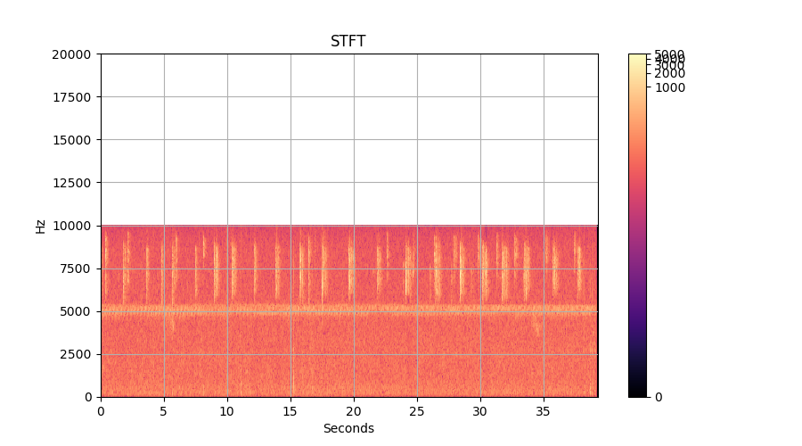
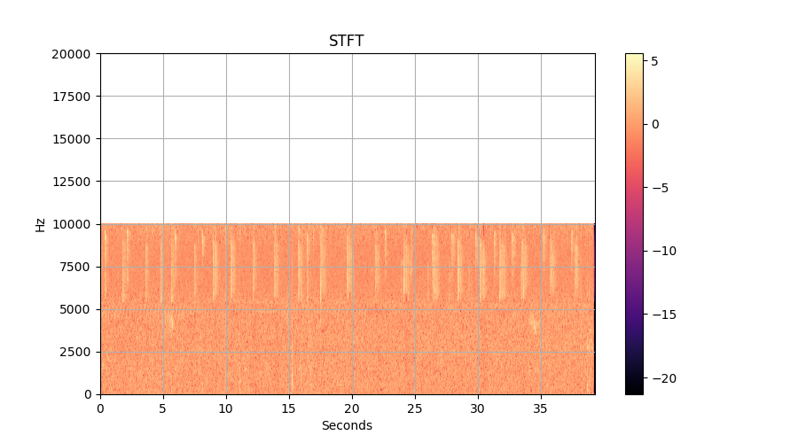

# BirdNet
Classifies bird species calls using deep learning.

## Bird Call Classifier
When visualizing sound data for quality and data exploration, simple waveform plots are not very useful. However, the output of a Short Time Fourier Transform (STFT) can be plotted using a heatmap to produce a much more useful spectrogram. This visualization reveals a quality problem with the sound data: noise around the 5kHz range.

In-frequency normalization of the sound data provides a simple noise filter, and creates data that is more suitable for training predictive models. Appropriate normalization and scaling can improve model fitting time and final model performance. Applying this normalization technique improved validation accuracy from approximately 40% to over 80% (on a 7 class problem).

